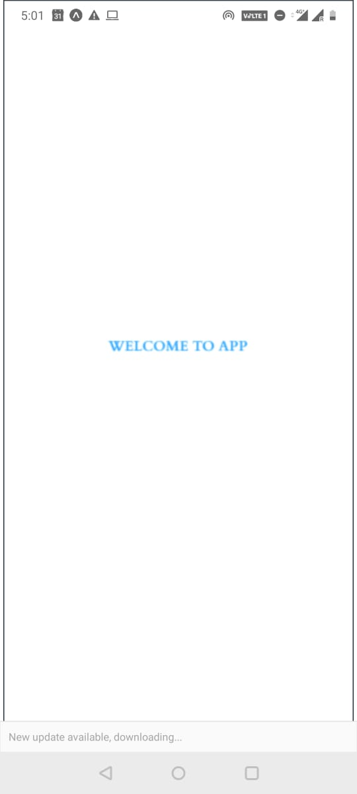
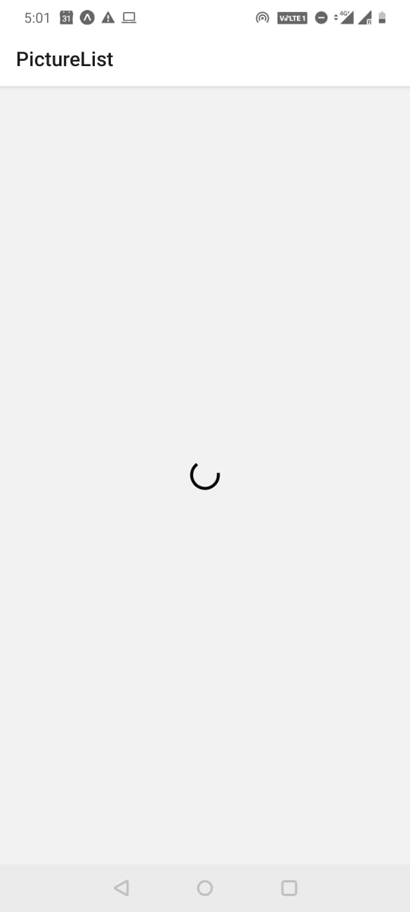
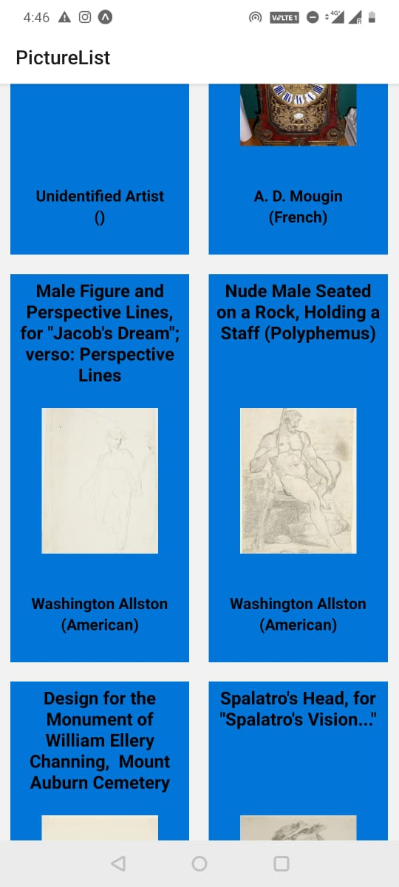
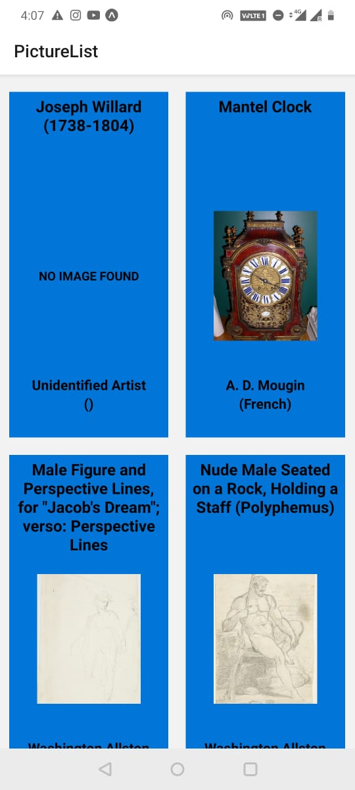
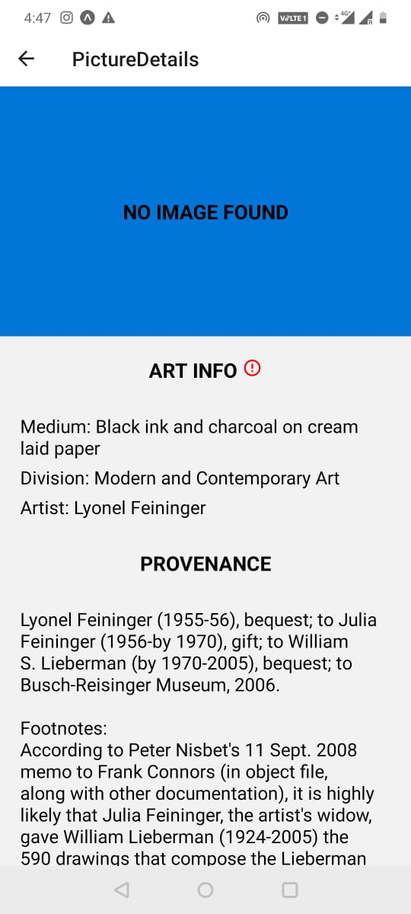
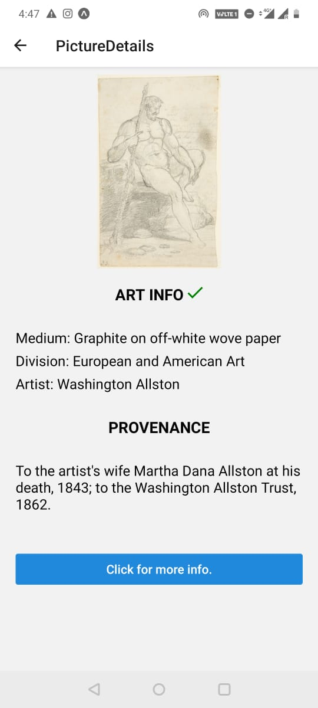

# MUSEUM APPLICATION
## Getting Started

This is a react native project created using expo. These steps need to be followed:

- `npm install`: This will install all the dependencies.
- `expo start`: This will launch a metro bundler which can be used to run the application.
- In `/store/actions.js` Line number **7** add the API key.

## Folder Structure and Tech Stack

For this project I have created three folders: `/components` for all the reusable components, `/store` for all the redux logic and `/screens` for the screens that we have in the app. 

I have used **react-native-elements** for some styling, **redux** for state management,  **redux-thunk** for async dispatches and **axios** for api calls. For the tick and error SVGs in the Details screen I have used some SVG libraries.

## Screenshots

Attaching screenshots of how the application looks.

 

 

 

 

 

 
